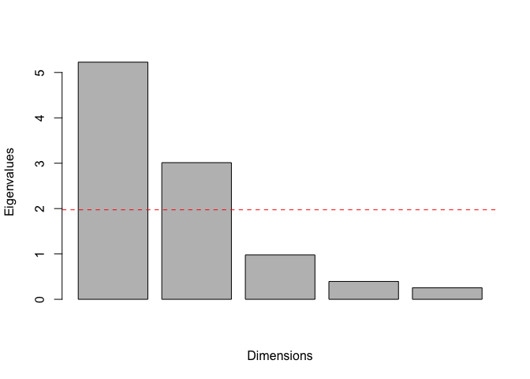
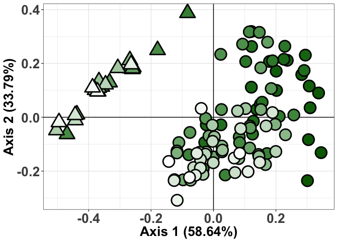

### Import the data

Note, the 2014 variables that contained 96 data points needed to be averaged in order to generate 24 data points that aligned with the 24 SDS.DX ratings taken in 2014.

``` r
#Import the 2015 data
df.2015 <- read.csv("2015_master.csv")
#Only take the first 96 data points - this excludes yield, which had 48 data points
df2.2015 <- df.2015[1:96,]


#2014 data needs to be averaged to match the DX ratings scale (convert 96 data points to 24)
df.2014 <- read.csv("2014_master.csv")
#Again, take the first 96 data points, which will be averaged below
df2.2014 <- df.2014[1:96,]
#First, average sample locations A1 and A2, A3 and A4, etc., for all combinations A+B, C+D, E+F
row.list <- 0
row.2014 <- 0
#Can exclude first 6 factor variables
row.2014.df <- cbind(df2.2014[,(7:33)])
#This code averages 96 observations into 48 
#For example, averages A1 and A2, A3 and A4, etc...
for (i in 1:27) {
  for (j in seq(1,96,2)) {
    row.list <- row.list + 1
    row.2014[[row.list]] <- (row.2014.df[j, i] + row.2014.df[j+1, i]) / 2
  }
}
#Put these averaged data into a new matrix
row.2014.mat <- matrix(row.2014, ncol = 27, nrow = 48)

#Now repeat, but average A1/A2 from above with B1/B2 from above
#Continue averaging A3/A4 with B3/B4, etc... for A1-A16 and B1-B16
avg.list <- 0
avg.2014 <- 0
avg.2014.df <- data.frame(row.2014.mat)
for (i in 1:27) {
  for (j in seq(1,8)) {
    avg.list <- avg.list + 1
    avg.2014[[avg.list]] <- (avg.2014.df[j, i] + avg.2014.df[j+8, i]) / 2
  }
}
#Put these averaged data into a new matrix
avg.2014.mat1 <- matrix(avg.2014, ncol = 27, nrow = 8)

#Continue averaging C1/C2 with D1/D2, C3/C4 with D3/D4, etc... C1-C16 and D1-D16
avg.list <- 0
avg.2014 <- 0
avg.2014.df <- data.frame(row.2014.mat)
for (i in 1:27) {
  for (j in seq(17,24)) {
    avg.list <- avg.list + 1
    avg.2014[[avg.list]] <- (avg.2014.df[j, i] + avg.2014.df[j+8, i]) / 2
  }
}
avg.2014.mat2 <- matrix(avg.2014, ncol = 27, nrow = 8)

#Continue averaging E1/E2 with F1/F2, E3/E4 with F3/F4, etc... E1-E16 and F1-F16
avg.list <- 0
avg.2014 <- 0
avg.2014.df <- data.frame(row.2014.mat)
for (i in 1:27) {
  for (j in seq(33,40)) {
    avg.list <- avg.list + 1
    avg.2014[[avg.list]] <- (avg.2014.df[j, i] + avg.2014.df[j+8, i]) / 2
  }
}
avg.2014.mat3 <- matrix(avg.2014, ncol = 27, nrow = 8)

#Now, rbind the three matricies into one dataframe with 24 rows
avg.2014.mat <- data.frame(rbind(avg.2014.mat1, 
                                 avg.2014.mat2,
                                 avg.2014.mat3))
#Give the variables the appropriate column names
colnames(avg.2014.mat) <- names(df2.2014[7:33])


#Finally, combine the data with the DX ratings
dx <- cbind(df.2014$R4.DX[97:120], 
            df.2014$R5.DX[97:120],
            df.2014$R6.DX[97:120],
            df.2014$Yield[97:120])
colnames(dx) <- c("R4.DX", "R5.DX", "R6.DX", "Yield")
all.2014 <- cbind(dx, avg.2014.mat)

#Add a sample identifier, 1-96 for 2015, 1-24 for 2014
sample.2015 <- c(1:96)
sample.2014 <- c(1:24)

#Drop unneccessary columns from 2015 file
all.2015 <- df2.2015[,-c(1:6)] #Drops "x", "y", Pass, Range, Sample, and Section

#Should be 96
nrow(all.2015)
```

    ## [1] 96

``` r
#Should be 24
nrow(all.2014)
```

    ## [1] 24

Next, pick the colors that you want to plot with, and create a custom color palette

``` r
color.pal <- c("#006600","#FFFFFF")
color.func <- colorRampPalette(color.pal)
```

3D Plots
--------

``` r
year <- "2014"
df1 <- cbind.data.frame(year, 
                        all.2014$Pre.ratio,
                        all.2014$PreSCN.juvs,
                        all.2014$R5.DX)
year <- "2015"
df2 <- cbind.data.frame(year, 
                        all.2015$Pre.ratio,
                        all.2015$PreSCN.juvs,
                        all.2015$R5.DX)
colnames(df1) <- c("Year","Fv.ratio","SCN.juvs","R5DX")
colnames(df2) <- c("Year","Fv.ratio","SCN.juvs","R5DX")

df.3d <- rbind.data.frame(df1, df2)
df.3d <- df.3d[order(df.3d$R5DX),] 
#install.packages("plot3D")
library(plot3D)
length(df.3d$R5DX)
```

    ## [1] 120

``` r
fit <- lm(df.3d$R5DX ~ df.3d$Fv + df.3d$SCN)
grid.lines = 10
x.pred <- seq(min(df.3d$Fv), max(df.3d$Fv), length.out = grid.lines)
y.pred <- seq(min(df.3d$SCN), max(df.3d$SCN), length.out = grid.lines)
xy <- expand.grid( x = x.pred, y = y.pred)
z.pred <- matrix(predict(fit, newdata = xy), 
                 nrow = grid.lines, ncol = grid.lines)
```

    ## Warning: 'newdata' had 100 rows but variables found have 120 rows

``` r
fitpoints <- predict(fit)

#3d plots are colored by 3rd (z) variable (R5DX)
scatter3D(df.3d$Fv, df.3d$SCN, df.3d$R5DX, 
          bty = "b2",
          pch = c(24, 21)[as.numeric(df.3d$Year)], cex = 2, 
          col="black",
          lwd = 1.5,
          bg=color.func(length(df.3d$R5DX)),
          theta = 45, phi = 20,
          main = "Fv-SCN-SDS Relationship",
          xlab = 'Fv ratio', 
          ylab = 'SCN juvs', 
          zlab = 'R5 SDS',
          surf = list(x = x.pred, y = y.pred, z = z.pred,  
                      facets = NA, fit = fitpoints,
                      border = "black",
                      col=color.func(length(df.3d$R5DX)))
          )
```


Principle Coordinates analysis
------------------------------

Using raw qPCR values and nematode quantities so that they are the same type of variable (as opposed to a ratio and raw quantities)

``` r
#Install and load packages as necessary
#install.packages("ape")
#install.packages("ecodist")
#install.packages("vegan")
#install.packages("ggplot2")
library(ape)
library(ecodist)
library(vegan)
```

    ## Loading required package: permute

    ## Loading required package: lattice

    ## This is vegan 2.5-3

    ## 
    ## Attaching package: 'vegan'

    ## The following object is masked from 'package:ecodist':
    ## 
    ##     mantel

``` r
library(ggplot2)

#Extract only the pre-planting variables of interest
pre.plant.2015 <- cbind.data.frame(df2.2015$Pre.qPCR, 
                                   df2.2015$PreSCN.juvs,
                                   df2.2015$Pre.spiral, 
                                   df2.2015$Pre.lesion, 
                                   df2.2015$Pre.dagger)
pre.plant.2014 <- cbind.data.frame(all.2014$Pre.qPCR, 
                                   all.2014$PreSCN.juvs,
                                   all.2014$Pre.spiral, 
                                   all.2014$Pre.lesion, 
                                   all.2014$Pre.dagger)
colnames(pre.plant.2014) <- c("Pre.qPCR",
                              "PreSCN.juvs",
                              "Pre.spiral",
                              "Pre.lesion",
                              "Pre.dagger")
colnames(pre.plant.2015) <- c("Pre.qPCR",
                              "PreSCN.juvs",
                              "Pre.spiral",
                              "Pre.lesion",
                              "Pre.dagger")
pre.plant <- rbind.data.frame(pre.plant.2014, pre.plant.2015)

#Determine number of rows and columns
n = nrow(pre.plant)
p = ncol(pre.plant)
rank.pre = min(n,p)

#Function to determine delta value for PCO
delta = function(D) {
  DD=as.matrix(D)
  n=nrow(DD)
  d=matrix(0,n,n)
  A=-0.5*(DD^2)
  Arm = rowMeans(A)
  Acm = colMeans(A)
  Agm = mean(A)
  
  for (i in 1:n) {
    for (j in 1:n) {
      d[i,j] = A[i,j] - Arm[i] - Acm[j] + Agm
    }}
  return(d)
}

#Begin calculating Bray-Curtis distances
pre.bray <- vegdist(pre.plant, method = "bray")
e.bray <- eigen(delta(pre.bray))

#Now calculate the eigenvectors of the delta matrix
pre.cmd <- cmdscale(pre.bray, k = rank.pre, eig = TRUE)
prop.pre <- as.matrix((pre.cmd$eig/sum(pre.cmd$eig))*100)
#This will determine the % variation explained for each dimention
prop.pre[1:rank.pre]
```

    ## [1] 58.638004 33.794146 10.975768  4.416834  2.855572

``` r
#So, dimention 1 explains 70.94%, Dimention 2 explains 16.27%, etc.

#Plot eigenvectors to determine which dimensions explain a significant amount of variance
barplot(pre.cmd$eig[1:rank.pre], main="",
   xlab="Dimensions", ylab = "Eigenvalues")
lines(pre.cmd$values)
abline(h = mean(pre.cmd$eig[1:rank.pre]), col = "red", lty = 2)
```



``` r
#The first 2 dimensions explain significant variance
#Extract points for plotting the first two dimensions in a PCO plot
pre.pco <- as.data.frame(pre.cmd$points)
#Add R5.DX for coloration
#pre.pco$R5.DX <- df2.2015$R5.DX
Year <- "2014"
DX.2014 <- cbind.data.frame(Year, 
                            all.2014$R5.DX,
                            all.2014$Pre.qPCR,
                            all.2014$PreSCN.juvs,
                            all.2014$Pre.spiral,
                            all.2014$Pre.lesion,
                            all.2014$Pre.dagger)
Year <- "2015"
DX.2015 <- cbind.data.frame(Year, 
                            df2.2015$R5.DX,
                            df2.2015$Pre.qPCR,
                            df2.2015$PreSCN.juvs,
                            df2.2015$Pre.spiral,
                            df2.2015$Pre.lesion,
                            df2.2015$Pre.dagger)
colnames(DX.2014) <- c("Year", "R5.DX", "Pre.qPCR",
                       "PreSCN.juvs", "Pre.spiral",
                       "Pre.lesion", "Pre.dagger")
colnames(DX.2015) <- c("Year", "R5.DX", "Pre.qPCR",
                       "PreSCN.juvs", "Pre.spiral",
                       "Pre.lesion", "Pre.dagger")
R5DX.df <- rbind.data.frame(DX.2014, DX.2015)
pre.pco$Year <- R5DX.df$Year
pre.pco$R5.DX <- R5DX.df$R5.DX
pre.pco$Pre.qPCR <- R5DX.df$Pre.qPCR
pre.pco$PreSCN.juvs <- R5DX.df$PreSCN.juvs
pre.pco$Pre.spiral <- R5DX.df$Pre.spiral
pre.pco$Pre.lesion <- R5DX.df$Pre.lesion
pre.pco$Pre.dagger <- R5DX.df$Pre.dagger

#for some reason, plotting pre.pco doesn't color the points correctly.
#For plotting only, reorder by "R5.DX" with the code below
#For subsequent analysis, make sure the data is NOT re-ordered by R5.DX
pre.pco <- pre.pco[order(pre.pco$R5.DX),] 

p <- ggplot(pre.pco, aes(x = V1, y = V2, color = pre.pco$R5.DX)) +
  geom_vline(xintercept = 0) +
  geom_hline(yintercept = 0) +
  geom_point(pch = c(24, 21)[as.numeric(pre.pco$Year)], 
                             color = "black", 
             bg=color.func(length(pre.pco$R5.DX)),
             size=7, stroke = 1.5) +
  xlab("Axis 1 (58.64%)") +
  ylab("Axis 2 (33.79%)") + 
  theme_bw() +
  theme(axis.text.x = element_text(size = 20, face = "bold"),
        axis.text.y = element_text(size = 20, face = "bold"),
        axis.title.x = element_text(size = 20, face = "bold"),
        axis.title.y = element_text(size = 20, face = "bold"),
        legend.title = element_text(size  = 0, face = "bold"),
        legend.text = element_text(size  = 20, face = "bold"))
p
```



A biplot is a great way to visualize PCO with input variables added as vectors.

``` r
#Install and load packages as necessary
#install.packages("ape")
#install.packages("ecodist")
#install.packages("devtools")
#install_github("vqv/ggbiplot")
library(ape)
library(ecodist)
library(devtools)
library(ggbiplot)
```

    ## Loading required package: plyr

    ## Loading required package: scales

    ## Loading required package: grid

``` r
#Extract only the pre-planting variables of interest
#For plotting biplot, comment out "Year"
#For doing levine's and bartlett tests, keep "year" in
pre.plant.2015 <- cbind.data.frame(df2.2015$Pre.qPCR, 
                                   df2.2015$PreSCN.juvs,
                                   df2.2015$Pre.spiral, 
                                   df2.2015$Pre.lesion, 
                                   df2.2015$Pre.dagger,
                                   #df2.2015$Sample,
                                   df2.2015$R5.DX,
                                   "2015"
                                   )

pre.plant.2014 <- cbind.data.frame(all.2014$Pre.qPCR, 
                                   all.2014$PreSCN.juvs,
                                   all.2014$Pre.spiral, 
                                   all.2014$Pre.lesion, 
                                   all.2014$Pre.dagger,
                                   #rownames(all.2014),
                                   all.2014$R5.DX,
                                   2014
                                   )

colnames(pre.plant.2014) <- c("Fv quantity",
                              "SCN juveniles",
                              "Spiral nematodes",
                              "Lesion nematodes",
                              "Dagger nematodes",
                              #"Sample",
                              "R5.DX",
                              "Year"
                              )
colnames(pre.plant.2015) <- c("Fv quantity",
                              "SCN juveniles",
                              "Spiral nematodes",
                              "Lesion nematodes",
                              "Dagger nematodes",
                              #"Sample",
                              "R5.DX",
                              "Year"
                              )
pre.plant <- rbind.data.frame(pre.plant.2014, pre.plant.2015)
pre.plant.4PCO <- pre.plant[,1:5]

#Determine the number of rows and columns, then scale the data
n = nrow(pre.plant.4PCO)
p = ncol(pre.plant.4PCO)
rank.pre = min(n,p)
pre.plant.scale <- scale(pre.plant.4PCO, scale = TRUE, center = TRUE)

#Perform the PCO
pre.pca <- prcomp(pre.plant.4PCO)
pre.pca$sdev
```

    ## [1] 258.21472 236.28064  26.83374  16.73489   0.88049

``` r
pre.eig <- eigen(var(pre.plant.4PCO))
#List the dimensions in order of variance explained
as.matrix((pre.eig$values/sum(pre.eig$values))*100)
```

    ##              [,1]
    ## [1,] 5.398586e+01
    ## [2,] 4.520374e+01
    ## [3,] 5.830159e-01
    ## [4,] 2.267585e-01
    ## [5,] 6.277214e-04

``` r
#Plot eigenvectors to determine which dimensions explain a significant amount of variance
barplot(pre.eig$values, main="",
   xlab="Dimensions", ylab = "Eigenvalues")
abline(h = mean(pre.eig$values), col = "red", lty = 2)
```


``` r
#Extract the PCO points for plotting the biplot, and add R5.DX for coloration
pre.points <- pre.pca$x
pre.pco <- as.data.frame(pre.points)
pre.pco$Year <- R5DX.df$Year
pre.pco$R5.DX <- R5DX.df$R5.DX
pre.pco$Pre.qPCR <- R5DX.df$Pre.qPCR
pre.pco$PreSCN.juvs <- R5DX.df$PreSCN.juvs
pre.pco$Pre.spiral <- R5DX.df$Pre.spiral
pre.pco$Pre.lesion <- R5DX.df$Pre.lesion
pre.pco$Pre.dagger <- R5DX.df$Pre.dagger

#Make the biplot
ggbiplot(pre.pca, choices = 1:2, obs.scale = 1, var.scale = 1, 
         varname.size = 5, varname.adjust = 1.1, 
         ellipse = F, circle = T, circle.prob = 0.9) +
  geom_vline(xintercept = 0) +
  geom_hline(yintercept = 0) +
  geom_point(aes(fill = pre.pco$R5.DX),
             pch = c(24, 21)[as.factor(pre.pco$Year)],
             size=7, stroke = 1.5) +
  scale_fill_gradientn(colours = color.func(120),
                         guide = guide_colorbar(barwidth = 2, 
                                                barheight = 20),
                         guide_legend(title = "R5.SDS.DX")) +
  theme_bw() +
  theme(axis.text.x = element_text(size = 20, face = "bold"),
        axis.text.y = element_text(size = 20, face = "bold"),
        axis.title.x = element_text(size = 20, face = "bold"),
        axis.title.y = element_text(size = 20, face = "bold"),
        legend.title = element_text(size  = 0, face = "bold"),
        legend.text = element_text(size  = 20, face = "bold"))
```


To examine how much each variable is contributing to explaining the variance in the PCO, use correlations to see how well each individual variable correlates to the first two dimensions

``` r
#Correlate Pre.qPCR with dimension 1
cor1 <- cor.test(pre.pco$PC1, y = pre.pco$Pre.qPCR)
#Correlate Pre.qPCR with dimension 2
cor1.2 <- cor.test(pre.pco$PC2, y = pre.pco$Pre.qPCR)
#Do the same with the rest of the variables
cor2 <- cor.test(pre.pco$PC1, y = pre.pco$PreSCN.juvs)
cor2.2 <- cor.test(pre.pco$PC2, y = pre.pco$PreSCN.juvs)
cor3 <- cor.test(pre.pco$PC1, y = pre.pco$Pre.spiral)
cor3.2 <- cor.test(pre.pco$PC2, y = pre.pco$Pre.spiral)
cor4 <- cor.test(pre.pco$PC1, y = pre.pco$Pre.lesion)
cor4.2 <- cor.test(pre.pco$PC2, y = pre.pco$Pre.lesion)
cor5 <- cor.test(pre.pco$PC1, y = pre.pco$Pre.dagger)
cor5.2 <- cor.test(pre.pco$PC2, y = pre.pco$Pre.dagger)

#Print the correlations for making a table
cor1
```

    ## 
    ##  Pearson's product-moment correlation
    ## 
    ## data:  pre.pco$PC1 and pre.pco$Pre.qPCR
    ## t = 15.507, df = 118, p-value < 2.2e-16
    ## alternative hypothesis: true correlation is not equal to 0
    ## 95 percent confidence interval:
    ##  0.7498780 0.8704839
    ## sample estimates:
    ##       cor 
    ## 0.8190337

``` r
cor1.2
```

    ## 
    ##  Pearson's product-moment correlation
    ## 
    ## data:  pre.pco$PC2 and pre.pco$Pre.qPCR
    ## t = 7.6094, df = 118, p-value = 7.399e-12
    ## alternative hypothesis: true correlation is not equal to 0
    ## 95 percent confidence interval:
    ##  0.4397168 0.6827659
    ## sample estimates:
    ##       cor 
    ## 0.5737387

``` r
cor2
```

    ## 
    ##  Pearson's product-moment correlation
    ## 
    ## data:  pre.pco$PC1 and pre.pco$PreSCN.juvs
    ## t = -9.0786, df = 118, p-value = 3.016e-15
    ## alternative hypothesis: true correlation is not equal to 0
    ## 95 percent confidence interval:
    ##  -0.7359304 -0.5220441
    ## sample estimates:
    ##        cor 
    ## -0.6412797

``` r
cor2.2
```

    ## 
    ##  Pearson's product-moment correlation
    ## 
    ## data:  pre.pco$PC2 and pre.pco$PreSCN.juvs
    ## t = 12.997, df = 118, p-value < 2.2e-16
    ## alternative hypothesis: true correlation is not equal to 0
    ## 95 percent confidence interval:
    ##  0.6818374 0.8321039
    ## sample estimates:
    ##       cor 
    ## 0.7673039

``` r
cor3
```

    ## 
    ##  Pearson's product-moment correlation
    ## 
    ## data:  pre.pco$PC1 and pre.pco$Pre.spiral
    ## t = -5.9921, df = 118, p-value = 2.307e-08
    ## alternative hypothesis: true correlation is not equal to 0
    ## 95 percent confidence interval:
    ##  -0.6094812 -0.3325549
    ## sample estimates:
    ##        cor 
    ## -0.4830054

``` r
cor3.2
```

    ## 
    ##  Pearson's product-moment correlation
    ## 
    ## data:  pre.pco$PC2 and pre.pco$Pre.spiral
    ## t = -0.10558, df = 118, p-value = 0.9161
    ## alternative hypothesis: true correlation is not equal to 0
    ## 95 percent confidence interval:
    ##  -0.1886314  0.1698185
    ## sample estimates:
    ##          cor 
    ## -0.009718673

``` r
cor4
```

    ## 
    ##  Pearson's product-moment correlation
    ## 
    ## data:  pre.pco$PC1 and pre.pco$Pre.lesion
    ## t = 1.3034, df = 118, p-value = 0.195
    ## alternative hypothesis: true correlation is not equal to 0
    ## 95 percent confidence interval:
    ##  -0.0614239  0.2921325
    ## sample estimates:
    ##      cor 
    ## 0.119129

``` r
cor4.2
```

    ## 
    ##  Pearson's product-moment correlation
    ## 
    ## data:  pre.pco$PC2 and pre.pco$Pre.lesion
    ## t = 2.1479, df = 118, p-value = 0.03376
    ## alternative hypothesis: true correlation is not equal to 0
    ## 95 percent confidence interval:
    ##  0.0152675 0.3606789
    ## sample estimates:
    ##      cor 
    ## 0.193978

``` r
cor5
```

    ## 
    ##  Pearson's product-moment correlation
    ## 
    ## data:  pre.pco$PC1 and pre.pco$Pre.dagger
    ## t = 0.36407, df = 118, p-value = 0.7165
    ## alternative hypothesis: true correlation is not equal to 0
    ## 95 percent confidence interval:
    ##  -0.1466247  0.2114687
    ## sample estimates:
    ##        cor 
    ## 0.03349698

``` r
cor5.2
```

    ## 
    ##  Pearson's product-moment correlation
    ## 
    ## data:  pre.pco$PC2 and pre.pco$Pre.dagger
    ## t = 0.576, df = 118, p-value = 0.5657
    ## alternative hypothesis: true correlation is not equal to 0
    ## 95 percent confidence interval:
    ##  -0.1275007  0.2300091
    ## sample estimates:
    ##        cor 
    ## 0.05295073

``` r
#Plot the correlations to see how well they correlate
plot(pre.pco$PC1 ~ pre.pco$Pre.qPCR)
```


``` r
plot(pre.pco$PC1 ~ pre.pco$PreSCN.juvs)
```


``` r
plot(pre.pco$PC1 ~ pre.pco$Pre.spiral)
```


``` r
plot(pre.pco$PC1 ~ pre.pco$Pre.lesion)
```


``` r
plot(pre.pco$PC1 ~ pre.pco$Pre.dagger)
```


``` r
plot(pre.pco$PC2 ~ pre.pco$Pre.qPCR)
```


``` r
plot(pre.pco$PC2 ~ pre.pco$PreSCN.juvs)
```


``` r
plot(pre.pco$PC2 ~ pre.pco$Pre.spiral)
```


``` r
plot(pre.pco$PC2 ~ pre.pco$Pre.lesion)
```


``` r
plot(pre.pco$PC2 ~ pre.pco$Pre.dagger)
```


